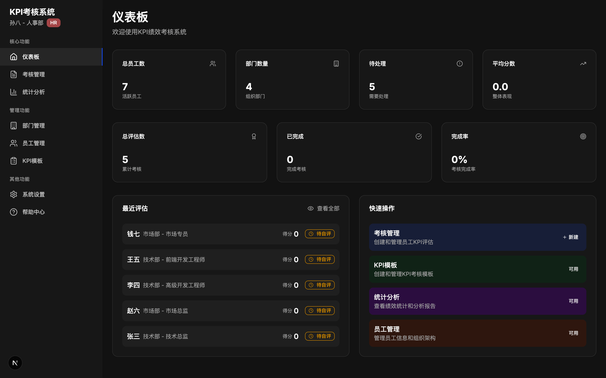

# DooTask KPI 绩效考核系统

一个基于 Next.js 和 Go 的现代化 KPI 绩效考核管理系统，支持多角色协作，让绩效管理变得更加高效和透明。



## 🚀 技术栈

### 前端
- **Next.js 15.3.5** - React 全栈框架
- **React 19** - 用户界面库
- **TypeScript** - 类型安全的 JavaScript
- **Tailwind CSS** - 实用优先的 CSS 框架
- **Radix UI** - 高质量的 UI 组件库
- **Recharts** - 数据可视化图表库
- **Axios** - HTTP 请求库
- **React Hook Form** - 表单处理库
- **Zod** - 数据验证库

### 后端
- **Go 1.23** - 高性能编程语言
- **Gin** - 轻量级 HTTP Web 框架
- **GORM** - Go 语言 ORM 库
- **SQLite** - 嵌入式数据库
- **JWT** - 用户认证和授权
- **bcrypt** - 密码加密
- **Excelize** - Excel 文件处理

## 📋 系统功能

### 🎯 核心功能
- **考核管理** - 创建、填写和管理绩效考核
- **邀请评分** - 邀请同事参与评分，获得多角度评价
- **统计分析** - 考核数据的图表和报表分析
- **仪表板** - 系统概览和关键指标展示

### 👥 管理功能
- **部门管理** - 组织架构和部门信息管理
- **员工管理** - 员工信息和权限管理
- **KPI 模板** - 考核模板的创建和维护

### ⚙️ 系统功能
- **用户认证** - 登录、注册和权限管理
- **系统设置** - 个性化配置和系统管理
- **数据导出** - Excel 格式数据导出
- **帮助中心** - 系统使用指南

## 🏗️ 系统架构

```
dootask-kpi/
├── app/                    # Next.js 应用目录
│   ├── auth/              # 认证页面
│   ├── departments/       # 部门管理
│   ├── employees/         # 员工管理
│   ├── evaluations/       # 考核管理
│   ├── statistics/        # 统计分析
│   ├── templates/         # 模板管理
│   └── settings/          # 系统设置
├── components/            # React 组件
│   └── ui/               # UI 组件库
├── lib/                  # 工具库和上下文
├── server/               # Go 后端服务
│   ├── handlers/         # HTTP 处理器
│   ├── models/           # 数据模型
│   ├── routes/           # 路由配置
│   └── utils/            # 工具函数
└── scripts/              # 脚本文件
```

## 🔐 用户角色

系统支持三种用户角色：

### 👤 普通员工 (employee)
- 查看和填写自己的绩效考核
- 接收并处理邀请评分任务
- 对其他员工进行客观评分
- 查看系统设置
- 访问帮助中心

### 👔 部门主管 (manager)
- 员工的所有功能
- 管理部门员工
- 评估下属的绩效考核
- 导出考核数据

### 👨‍💼 HR 管理员 (hr)
- 所有系统功能的完全访问权限
- 管理部门和员工
- 创建和管理 KPI 模板
- 发起和管理邀请评分
- 系统设置配置
- 数据统计分析

## 📊 考核流程

1. **创建考核** - HR 或主管创建考核任务，选择模板和被考核人员
2. **员工自评** - 员工填写自我评价，对各项指标进行评分
3. **主管评估** - 主管对员工进行评估，给出评分和反馈
4. **邀请评分**（可选）- HR 可邀请其他人员对员工进行评分，获取多方面评价
5. **HR 审核** - HR 审核评估结果，确认最终评分
6. **员工确认** - 员工确认最终得分，考核流程完成

## 🤝 邀请评分功能

### 📋 功能特点
- **多角度评价**：通过邀请不同人员参与评分，获得更全面的员工评价
- **灵活邀请**：HR 可以选择合适的人员进行邀请，支持多人同时评分
- **状态管理**：实时跟踪邀请状态（待接受、进行中、已完成、已拒绝）
- **客观评分**：被邀请人员基于对员工的了解进行客观评分

### 🔄 邀请流程
1. **发起邀请** - HR 在主管评估完成后发起邀请评分
2. **选择评分人** - 选择了解被评估员工的人员进行邀请
3. **接受邀请** - 被邀请人员可以选择接受或拒绝邀请
4. **进行评分** - 接受邀请后对员工各项指标进行评分
5. **提交结果** - 完成评分并提交评价结果
6. **HR 参考** - HR 将邀请评分作为审核的重要参考

### 👥 参与角色
- **HR 管理员**：发起邀请、管理邀请进展、查看评分结果
- **被邀请人员**：接收邀请、进行评分、提供客观评价
- **被评估员工**：邀请评分的对象，无需参与邀请评分过程

### 📊 评分原则
- **客观公正**：基于对员工的实际了解进行评分
- **具体详实**：提供具体的评分依据和改进建议
- **保密性**：评分结果仅 HR 可查看完整详情
- **可选性**：如对员工不够了解，可选择拒绝邀请

## 🛠️ 安装和使用

### 环境要求
- Node.js 18+
- Go 1.23+

### 快速启动

1. **克隆项目**
```bash
git clone https://github.com/dootask/kpi
cd kpi
```

2. **安装前端依赖**
```bash
npm install
```

3. **安装后端依赖**
```bash
cd server
go mod tidy
cd ..
```

4. **启动开发环境**
```bash
# 同时启动前后端（推荐）
npm run dev:all

# 或者分别启动
npm run dev          # 仅启动前端
cd server && CGO_ENABLED=1 go run main.go  # 仅启动后端
```

5. **访问系统**
- 前端：http://localhost:3000
- 后端：http://localhost:8080

### 生产环境部署

1. **构建前端**
```bash
npm run build
npm run start
```

2. **构建后端**
```bash
cd server
CGO_ENABLED=1 go build -o kpi-server main.go
./kpi-server
```

## 🗄️ 数据库

系统使用 SQLite 作为数据库，数据文件位于 `server/db/kpi.db`。

### 数据表结构
- `departments` - 部门信息
- `employees` - 员工信息
- `kpi_templates` - KPI 模板
- `kpi_items` - KPI 考核项目
- `kpi_evaluations` - 考核记录
- `kpi_scores` - 考核得分
- `evaluation_comments` - 评估评论
- `evaluation_invitations` - 邀请评分记录
- `invited_scores` - 邀请评分得分
- `system_settings` - 系统设置

## 📱 响应式设计

系统采用响应式设计，完美适配：
- 桌面端（1200px+）
- 平板端（768px - 1199px）
- 移动端（< 768px）

## 🌓 主题支持

系统支持明暗主题切换，用户可以根据个人喜好选择合适的主题。

## 📈 功能特性

- ✅ 完整的用户认证和授权系统
- ✅ 多角色权限管理
- ✅ 邀请评分功能，支持360度评估
- ✅ 响应式设计，支持移动端
- ✅ 实时数据统计和图表展示
- ✅ Excel 数据导出功能
- ✅ 完整的考核流程管理
- ✅ 系统设置和配置管理
- ✅ 暗黑模式支持
- ✅ 组件化设计，易于扩展

## 🤝 默认测试账户

系统启动后会自动创建测试数据，包括以下默认账户（默认密码均为：`123456`）：

### HR 管理员账户
- **账户**：sunba@company.com
- **姓名**：孙八
- **职位**：HR经理
- **权限**：系统全部功能

### 部门主管账户
- **技术总监**：zhangsan@company.com (张三)
- **市场总监**：zhaoliu@company.com (赵六)
- **财务经理**：zhoujiu@company.com (周九)
- **权限**：部门管理、员工考核、数据导出

### 普通员工账户
- **技术员工**：lisi@company.com (李四)、wangwu@company.com (王五)
- **市场员工**：qianqi@company.com (钱七)
- **权限**：查看和填写个人考核

## 📄 许可证

本项目仅供学习和参考使用。

## 👨‍💻 作者

基于 Next.js 和 Go 开发的现代化 KPI 管理系统。
